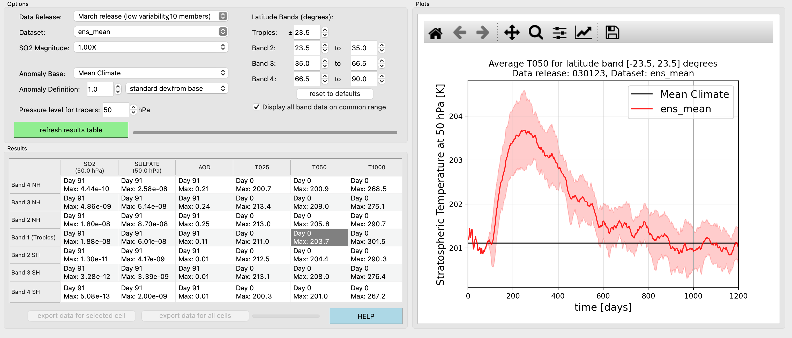

# HSW-V Toolkit

A graphical interface for computing time series of zonal-average variables of latitude bands in the HSW-V limited variability datasets, and visualizing the results



# Usage

1. Clone the repository
   
`clone https://github.com/jhollowed/hswpp_toolkit.git`
   
2. Launch the application

```
cd hswpp_toolkit
python ./interface.py
```

3. Make selections in the `Options` pane

   Set the desired configuration in the various options above the `Results` table. This includes:

   - the `Data Release` (correspondoing to different HSW-V ensembles)
   - the `Dataset` (corresponding to different ensemble members, or the ensemble mean, of the chose `Data Release`)
   - the `SO2 Magnitude` (corresponding to ensembles in this `Data Release` of varying eruption magnitudes)
   - the `Latitude Bands` (defines the northern and southern boundaries of four latitude bands)
   - the `Anomaly Base` (variable anomalies will be defined with respect to this dataset)
   - the `Anomaly Definition` (variable anomalies will be defined by this criteria
   - the `Pressure Level for Tracers` (the three-dimensional tracer fields `SO2` and `SULFATE` will be reduced to a two-dimensional horizontal field at the vertical level nearest this pressure)
  
     If any of these options are disabled (faint text, unclickable), then they are not currently available in this release of the Toolkit, or the datasets for those selections do not exist.
  
4. Press `refresh results table`

5. A `pyplot` figure will be rendered on the right in the `Plot` pane. This fiure is interactive, with the ability to pan and zoom, using the arrow and magnifying glass icons. When zooming or panning, the axes labels and tick marks will update to accomodate the change. The figure can also be saved with the floppy disk icon.

6. repeat steps 3-5 as needed. Pressing `refresh results table` will always overwrite the current table with new results corresponding to the currently selection `Options`

If the chosen `Data Release` has not yet been run with the current installation of HSW-V Toolkit when `refresh results table` is pressed, it will be downloaded from FigShare. When this occurs, the `refresh results table` button will be altered to read `fetching data...`. The download will take several minutes. Progress will be represented in the progress bar to the right of the button, as well as more detailed progress printed to the terminal.

Likewise, if the chosen *Dataset* is `ens_mean`, then the ensemble mean for the selectied `Data Release` will be computed internally by the Toolkit. This should be fast. Progress of this operation is printed to the terminal.
